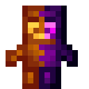

# Тотем равноденствия

<figure><figcaption></figcaption></figure>

## Получение

#### _Крафт_

|                                                                                                                                                                                     |  Тотем равноденствия                              |
| ----------------------------------------------------------------------------------------------------------------------------------------------------------------------------------- | ------------------------------------------------- |
| 
<a href="ritual_focus_greater.md">Усилитель ритульного фокуса</a> + Тотем бессмертия + Стекло + <a href="ritual_focus_lesser.md">Уменьшитель ритуального фокуса</a>
 |  |

## Использование

#### _Как ингредиент при крафте_

#### [Драгоценная печать](perk_seal.md)

|                                                                                                                                                                                                                                    |  Драгоценная печать                       |
| ---------------------------------------------------------------------------------------------------------------------------------------------------------------------------------------------------------------------------------- | ----------------------------------------- |
| 
<a href="totem_of_equinox.md">Тотем равноденствия</a> + <a href="spawner_seeker.md">Пространственное ядро</a> + <a href="purple_blaze.md">Фиолетовое пламя</a> + <a href="equinox_clock.md">Часы равноденствия</a>
 |  |

