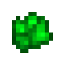

# Кристалл уранита

<figure><figcaption></figcaption></figure>

## Получение

#### _Крафт_

|                                                                                                                             |  Кристалл уранита                                 |
| --------------------------------------------------------------------------------------------------------------------------- | ------------------------------------------------- |
| 
<a href="uraninite_raw_dense.md">Плотный сырой уранит</a> + <a href="spawner_seeker.md">Пространственное ядро</a>
 |  |

## Использование

#### _Как ингредиент при крафте_

#### [Кусок арлемита](arlemite_nugget.md)

|                                                                                                           |  Кусок арлемита                                 |
| --------------------------------------------------------------------------------------------------------- | ----------------------------------------------- |
| 
<a href="fury_fire.md">Яростный огонь</a> + <a href="uraninite_crystal.md">Кристалл уранита</a>
 |  |

