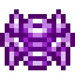

# Вуаль

<figure><figcaption></figcaption></figure>

## Получение

#### _Крафт_

|                                                                                                                       |  Вуаль                               |
| --------------------------------------------------------------------------------------------------------------------- | ------------------------------------ |
| 
Изумруд<a href="fireite_ingot.md">Огненный слиток</a> + <a href="xp_crystal_4.md">Кристалл опыта 5  ур.</a>
 |  |

## Использование

#### _Как ингредиент при крафте_

#### [Коррозийная душа монстра](basemonstersoul_corrosive.md)

|                                                                                                                                                                                                                                                            |  Коррозийная душа монстра                                 |
| ---------------------------------------------------------------------------------------------------------------------------------------------------------------------------------------------------------------------------------------------------------- | --------------------------------------------------------- |
| 
<a href="purple_blaze.md">Фиолетовое пламя</a> + <a href="veilo.md">Вуаль</a> + <a href="sentientarmourgem_corrosive_activated.md">Активированный камень коррозийной разумной брони</a> + <a href="weak_arcana_potion.md">Зелье Арканы</a>
 |  |

