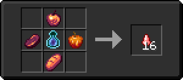
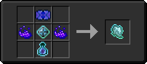

# Зелье Арканы

<figure><figcaption></figcaption></figure>

## Получение

#### _Крафт_

|                                                                                                                                                                                   | Зелье Арканы                                        |
| --------------------------------------------------------------------------------------------------------------------------------------------------------------------------------- | --------------------------------------------------- |
| 
Пузырёк опыта<a href="blizz_rod.md">Стержень метели</a> + <a href="star_flare.md">Звездная вспышка</a> + Драконье дыхание + <a href="aquamarine.md">Аквамарин</a>
 |  |

## Использование

#### _Как ингредиент при крафте_

#### [Запретный плод](forbidden\_fruit.md)

|                                                                                                                                                                                                                                                                                                                                                                                                                                                   | Запретный плод                                  |
| ------------------------------------------------------------------------------------------------------------------------------------------------------------------------------------------------------------------------------------------------------------------------------------------------------------------------------------------------------------------------------------------------------------------------------------------------- | ----------------------------------------------- |
| 
<a href="_netherwart.md">Адское яблоко</a> + <a href="weak_arcana_potion.md">Зелье Арканы</a> + <a href="lofty_stature.md">Яблоко роста</a> + <a href="_chocolate.md">Шоколадное яблоко</a> + <a href="ethereal_arc.md">Эфирная дуга</a> + <a href="ender.md">Яблоко Эндера</a> + <a href="_chorus.md">Яблоко хоруса</a> + <a href="bone.md">Костное яблоко</a> + <a href="prismarine.md">Призмариновое яблоко</a>
 |  |

#### [Морковь мечты](dream\_carrot.md)

|                                                                                                                                                                                                                                                                                                                                                                                                      | Морковь мечты                                |
| ---------------------------------------------------------------------------------------------------------------------------------------------------------------------------------------------------------------------------------------------------------------------------------------------------------------------------------------------------------------------------------------------------- | -------------------------------------------- |
| 
<a href="carrot_diamond.md">Алмазная морковь</a> + <a href="weak_arcana_potion.md">Зелье Арканы</a> + <a href="carrot_emerald.md">Изумрудная морковь</a> + Золотая морковь + <a href="ectoplasm.md">Эктоплазма</a> + <a href="carrot_redstone.md">Морковь редстоуна</a> + <a href="carrot_lapis.md">Лазуритная морковь</a> + <a href="carrot_ender.md">Ендер морковь</a>
 |  |

#### [Торт мечты](dream\_cake.md)

|                                                                                                                                                                                                                                      | Торт мечты                                 |
| ------------------------------------------------------------------------------------------------------------------------------------------------------------------------------------------------------------------------------------ | ------------------------------------------ |
| 
Ведро молока<a href="ectoplasm.md">Эктоплазма</a> + <a href="weak_arcana_potion.md">Зелье Арканы</a> + Торт + <a href="chocolate_cake.md">Шоколадный торт</a> + <a href="inventory_cake.md">Инвентарьный торт</a>
 |  |

#### [Пирог мечты](dream\_pie.md)

|                                                                                                                                                                                                                                                                                                                                                                                                                                                                                       | Пирог мечты                               |
| ------------------------------------------------------------------------------------------------------------------------------------------------------------------------------------------------------------------------------------------------------------------------------------------------------------------------------------------------------------------------------------------------------------------------------------------------------------------------------------- | ----------------------------------------- |
| 
<a href="shepherds_pie_block.md">Пирог пастуха</a> + <a href="chocolate_pie.md">Шоколадный пирог</a> + <a href="blaze_cake.md">Пылающий пирог</a> + <a href="cherry_pie.md">Вишневый пирог</a> + <a href="weak_arcana_potion.md">Зелье Арканы</a> + <a href="crimson_berry_pie.md">Малиновый пирог</a> + <a href="source_berry_pie.md">Исходный пирог</a> + <a href="apple_pie.md">Яблочный пирог</a> + <a href="blueberry_pie.md">Черничный пирог</a>
 |  |

#### [Адское ядро](gobber2\_goo\_nether.md)

|                                                                                                                       | Адское ядро                                         |
| --------------------------------------------------------------------------------------------------------------------- | --------------------------------------------------- |
| 
<a href="weak_arcana_potion.md">Зелье Арканы</a> + Звезда Незера + Незеритовый слиток + Сгусток магмы
 |  |

#### [Фиолетовое пламя](purple\_blaze.md)

|                                                                                                                         | Фиолетовое пламя                             |
| ----------------------------------------------------------------------------------------------------------------------- | -------------------------------------------- |
| 
<a href="fury_fire.md">Яростный огонь</a> + <a href="weak_arcana_potion.md">Зелье Арканы</a> + Осколок эха
 |  |

#### [Кислотная капля](acid.md)

|                                                                                                                                                                                                                                                                                                                                                      | Кислотная капля                     |
| ---------------------------------------------------------------------------------------------------------------------------------------------------------------------------------------------------------------------------------------------------------------------------------------------------------------------------------------------------- | ----------------------------------- |
| 
<a href="gobber2_gooey_apple_nether.md">Адское зачарованное яблоко</a> + <a href="weak_arcana_potion.md">Зелье Арканы</a> + <a href="honeyed_apple.md">Адское медовое яблоко</a> + <a href="gobber2_gooey_bread_nether.md">Адский зачарованный хлеб</a> + <a href="gobber2_gooey_beef_nether.md">Адская зачарованная говядина</a>
 |  |

#### [Тьма](dark.md)

|                                                                                                                                                                                                                                                       | Тьма                                |
| ----------------------------------------------------------------------------------------------------------------------------------------------------------------------------------------------------------------------------------------------------- | ----------------------------------- |
| 
<a href="dream_pie.md">Пирог мечты</a> + <a href="weak_arcana_potion.md">Зелье Арканы</a> + <a href="dream_carrot.md">Морковь мечты</a> + <a href="dream_cake.md">Торт мечты</a> + <a href="forbidden_fruit.md">Запретный плод</a>
 |  |

#### [Камень душ](soulstone.md)

|                                                                                                                               | Камень душ                               |
| ----------------------------------------------------------------------------------------------------------------------------- | ---------------------------------------- |
| 
<a href="blood_infusion_core.md">Сердечник для инфузии крови</a> + <a href="weak_arcana_potion.md">Зелье Арканы</a>
 |  |

#### [Душа монстра](basemonstersoul.md)

|                                                                                                                                                                                                                                                             | Душа монстра                                   |
| ----------------------------------------------------------------------------------------------------------------------------------------------------------------------------------------------------------------------------------------------------------- | ---------------------------------------------- |
| 
<a href="purple_blaze.md">Фиолетовое пламя</a> + <a href="band_of_heiva_hunting.md">Сердце Хейву</a> + <a href="sentientarmourgem_activated.md">Активированный камень разумной брони</a> + <a href="weak_arcana_potion.md">Зелье Арканы</a>
 |  |

#### [Коррозийная душа монстра](basemonstersoul\_corrosive.md)

|                                                                                                                                                                                                                                                            | Коррозийная душа монстра                                  |
| ---------------------------------------------------------------------------------------------------------------------------------------------------------------------------------------------------------------------------------------------------------- | --------------------------------------------------------- |
| 
<a href="purple_blaze.md">Фиолетовое пламя</a> + <a href="veilo.md">Вуаль</a> + <a href="sentientarmourgem_corrosive_activated.md">Активированный камень коррозийной разумной брони</a> + <a href="weak_arcana_potion.md">Зелье Арканы</a>
 |  |

#### [Разрушительная душа монстра](basemonstersoul\_destructive.md)

|                                                                                                                                                                                                                                                                               | Разрушительная душа монстра                                 |
| ----------------------------------------------------------------------------------------------------------------------------------------------------------------------------------------------------------------------------------------------------------------------------- | ----------------------------------------------------------- |
| 
<a href="purple_blaze.md">Фиолетовое пламя</a> + <a href="runic_arc.md">Руническая дуга</a> + <a href="sentientarmourgem_destructive_activated.md">Активированный камень разрушительной разумной брони</a> + <a href="weak_arcana_potion.md">Зелье Арканы</a>
 |  |

#### [Стойкая душа монстра](basemonstersoul\_steadfast.md)

|                                                                                                                                                                                                                                                                 | Стойкая душа монстра                                      |
| --------------------------------------------------------------------------------------------------------------------------------------------------------------------------------------------------------------------------------------------------------------- | --------------------------------------------------------- |
| 
<a href="purple_blaze.md">Фиолетовое пламя</a> + <a href="astrolabe.md">Астролябия</a> + <a href="sentientarmourgem_steadfast_activated.md">Активированный камень стойкой разумной брони</a> + <a href="weak_arcana_potion.md">Зелье Арканы</a>
 |  |

#### [Мстительная душа монстра](basemonstersoul\_vengeful.md)

|                                                                                                                                                                                                                                                              | Мстительная душа монстра                                 |
| ------------------------------------------------------------------------------------------------------------------------------------------------------------------------------------------------------------------------------------------------------------ | -------------------------------------------------------- |
| 
<a href="purple_blaze.md">Фиолетовое пламя</a> + <a href="hitchak.md">Хитчак</a> + <a href="sentientarmourgem_vengeful_activated.md">Активированный камень мстительной разумной брони</a> + <a href="weak_arcana_potion.md">Зелье Арканы</a>
 |  |

#### [Кусок красного алмаза](red\_diamond\_chunk.md)

|                                                                                                                                                                     | Кусок красного алмаза                              |
| ------------------------------------------------------------------------------------------------------------------------------------------------------------------- | -------------------------------------------------- |
| 
<a href="red_glowcane_dust.md">Пыль красного алмаза</a> + <a href="weak_arcana_potion.md">Зелье Арканы</a> + <a href="fury_fire.md">Яростный огонь</a>
 |  |

#### [Кусок зеленого алмаза](green\_diamond\_chunk.md)

|                                                                                                                                                       | Кусок зеленого алмаза                                |
| ----------------------------------------------------------------------------------------------------------------------------------------------------- | ---------------------------------------------------- |
| 
<a href="low.md">Пыль зеленого алмаза</a> + <a href="weak_arcana_potion.md">Зелье Арканы</a> + <a href="fury_fire.md">Яростный огонь</a>
 |  |

#### [Кусок желтого алмаза](yellow\_diamond\_chunk.md)

|                                                                                                                                                         | Кусок желтого алмаза                                  |
| ------------------------------------------------------------------------------------------------------------------------------------------------------- | ----------------------------------------------------- |
| 
<a href="medium.md">Пыль желтого алмаза</a> + <a href="weak_arcana_potion.md">Зелье Арканы</a> + <a href="fury_fire.md">Яростный огонь</a>
 |  |

#### [Кусок синего алмаза](blue\_diamond\_chunk.md)

|                                                                                                                                                      | Кусок синего алмаза                                 |
| ---------------------------------------------------------------------------------------------------------------------------------------------------- | --------------------------------------------------- |
| 
<a href="high.md">Пыль синего алмаза</a> + <a href="weak_arcana_potion.md">Зелье Арканы</a> + <a href="fury_fire.md">Яростный огонь</a>
 |  |

#### [Часы Луны](moon\_clock.md)

|                                                                                                                                | Часы Луны                                  |
| ------------------------------------------------------------------------------------------------------------------------------ | ------------------------------------------ |
| 
<a href="perk_gem_night.md">Драгоценный камень ночи</a> + Часы + <a href="weak_arcana_potion.md">Зелье Арканы</a>
 |  |

#### [Часы Солнца](mysterious\_clock.md)

|                                                                                                                             | Часы Солнца                                      |
| --------------------------------------------------------------------------------------------------------------------------- | ------------------------------------------------ |
| 
<a href="perk_gem_day.md">Драгоценный камень дня</a> + Часы + <a href="weak_arcana_potion.md">Зелье Арканы</a>
 |  |

#### [Часы равноденствия](equinox\_clock.md)

|                                                                                                                                                       | Часы равноденствия                            |
| ----------------------------------------------------------------------------------------------------------------------------------------------------- | --------------------------------------------- |
| 
<a href="moon_clock.md">Часы Луны</a> + <a href="weak_arcana_potion.md">Зелье Арканы</a> + <a href="mysterious_clock.md">Часы Солнца</a>
 |  |

#### [Волшебный слиток](fairy\_ingot.md)

|                                                                                                                | Волшебный слиток                            |
| -------------------------------------------------------------------------------------------------------------- | ------------------------------------------- |
| 
Незер-кварц<a href="weak_arcana_potion.md">Зелье Арканы</a> + <a href="dislocator.md">Дислокатор</a>
 |  |

#### [Драконья чешуя](dragon\_scale.md)

|                                                                                      | Драконья чешуя                               |
| ------------------------------------------------------------------------------------ | -------------------------------------------- |
| 
Алмаз<a href="weak_arcana_potion.md">Зелье Арканы</a> + Незеритовый слиток
 |  |

#### [Кусок Дарвена](darven\_lump.md)

|                                                                                                                         | Кусок Дарвена                               |
| ----------------------------------------------------------------------------------------------------------------------- | ------------------------------------------- |
| 
Редстоуновая пыль<a href="weak_arcana_potion.md">Зелье Арканы</a> + <a href="fury_fire.md">Яростный огонь</a>
 |  |

#### [Диск Дарвена](darven\_disk.md)

|                                                                                                                       | Диск Дарвена                                |
| --------------------------------------------------------------------------------------------------------------------- | ------------------------------------------- |
| 
Железный слиток<a href="weak_arcana_potion.md">Зелье Арканы</a> + <a href="fury_fire.md">Яростный огонь</a>
 |  |

#### [Модуль памяти 1 ур.](256k.md)

|                                                                                                                    | Модуль памяти 1 ур.                       |
| ------------------------------------------------------------------------------------------------------------------ | ----------------------------------------- |
| 
<a href="logic_processor.md">Логический процессор</a> + <a href="weak_arcana_potion.md">Зелье Арканы</a>
 | .png>) |
