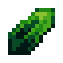

# Кристалл опыта 1 ур.

<figure><figcaption></figcaption></figure>

## Получение

#### _Крафт_

|                                                                                                            |  Кристалл опыта 1 ур.                         |
| ---------------------------------------------------------------------------------------------------------- | --------------------------------------------- |
| 
<a href="purple_blaze.md">Фиолетовое пламя</a> + <a href="arlemite_ingot.md">Слиток арлемита</a>
 |  |

## Использование

#### _Как ингредиент при крафте_

#### [Кристалл опыта 2 ур.](xp_crystal_1.md)

|                                                                                                                                                                          |  Кристалл опыта 2 ур.                         |
| ------------------------------------------------------------------------------------------------------------------------------------------------------------------------ | --------------------------------------------- |
| 
<a href="purple_blaze.md">Фиолетовое пламя</a> + <a href="spawner_seeker.md">Пространственное ядро</a> + <a href="xp_crystal_0.md">Кристалл опыта 1 ур.</a>
 |  |

