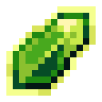

# Кристалл опыта 4 ур.

<figure><figcaption></figcaption></figure>

## Получение

#### _Крафт_

|                                                                                                                                                                          |  Кристалл опыта 4 ур.                         |
| ------------------------------------------------------------------------------------------------------------------------------------------------------------------------ | --------------------------------------------- |
| 
<a href="purple_blaze.md">Фиолетовое пламя</a> + <a href="spawner_seeker.md">Пространственное ядро</a> + <a href="xp_crystal_2.md">Кристалл опыта 3 ур.</a>
 |  |

## Использование

#### _Как ингредиент при крафте_

#### [Кристалл опыта 5  ур.](xp_crystal_4.md)

|                                                                                                                                                                          |  Кристалл опыта 5  ур.                        |
| ------------------------------------------------------------------------------------------------------------------------------------------------------------------------ | --------------------------------------------- |
| 
<a href="purple_blaze.md">Фиолетовое пламя</a> + <a href="spawner_seeker.md">Пространственное ядро</a> + <a href="xp_crystal_3.md">Кристалл опыта 4 ур.</a>
 |  |

