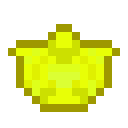

# Кусок желтого алмаза

<figure><figcaption></figcaption></figure>

## Получение

#### _Крафт_

|                                                                                                                                                         |  Кусок желтого алмаза                                 |
| ------------------------------------------------------------------------------------------------------------------------------------------------------- | ----------------------------------------------------- |
| 
<a href="medium.md">Пыль желтого алмаза</a> + <a href="weak_arcana_potion.md">Зелье Арканы</a> + <a href="fury_fire.md">Яростный огонь</a>
 |  |

## Использование

#### _Как ингредиент при крафте_

#### [Ледяной камень](ice_stone.md)

|                                                                                                                       |  Ледяной камень                           |
| --------------------------------------------------------------------------------------------------------------------- | ----------------------------------------- |
| 
<a href="fireite_ingot.md">Огненный слиток</a> + <a href="yellow_diamond_chunk.md">Кусок желтого алмаза</a>
 |  |

