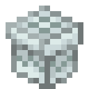

# Обычный подарок

<figure><figcaption></figcaption></figure>

## Получение

#### _Нестабильный пресс_

Для получения обычного подарка необходимо положить в нестабильный пресс, который можно найти на `/spawn`, [обычный кокон](broken-reference).

<figure><figcaption></figcaption></figure>

## Использование

#### _Обмен_

Обычный подарок можно обменять на [закрытый обычный подарок](gift\_common\_advance.md).
