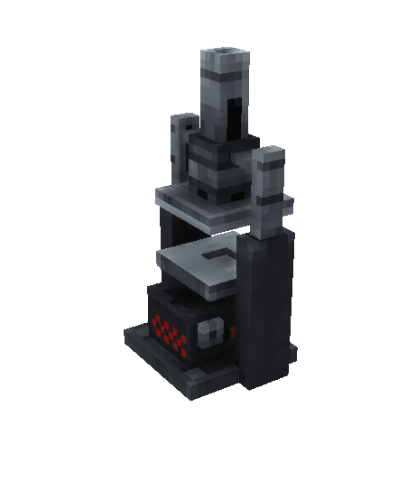

# Редкий подарок

<figure><figcaption></figcaption></figure>

## Получение

#### _Нестабильный пресс_

Для получения [редкого подарка](./) необходимо положить в нестабильный пресс, который можно найти на `/spawn`, [редкий кокон](broken-reference).

<figure><figcaption></figcaption></figure>

## Использование

#### _Обмен_

Редкий подарок можно обменять на [закрытый редкий подарок](gift\_rare\_advance.md).
