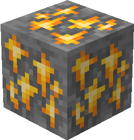
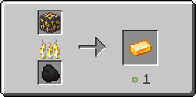

# Цитриновая руда

Цитриновая руда генерируется только в Верхнем мире в [определенных биомах](citrinovaya-ruda.md#v-kakikh-biomakh) в виде скоплений, состоящих из одного — двух блоков.

<figure><figcaption>
Цитриновая руда/ Цитриноносный глубинный сланец
</figcaption></figure>

## Генерация

#### В каких биомах?

* [Карстовая пещера](https://minecraft.fandom.com/ru/wiki/%D0%9A%D0%B0%D1%80%D1%81%D1%82%D0%BE%D0%B2%D0%B0%D1%8F\_%D0%BF%D0%B5%D1%89%D0%B5%D1%80%D0%B0)[ 🔗](https://minecraft.fandom.com/ru/wiki/%D0%A2%D1%91%D0%BF%D0%BB%D1%8B%D0%B9\_%D0%BE%D0%BA%D0%B5%D0%B0%D0%BD)
* [Пышные пещеры](https://minecraft.fandom.com/ru/wiki/%D0%9F%D1%8B%D1%88%D0%BD%D1%8B%D0%B5\_%D0%BF%D0%B5%D1%89%D0%B5%D1%80%D1%8B) [🔗](https://minecraft.fandom.com/ru/wiki/%D0%A3%D0%BC%D0%B5%D1%80%D0%B5%D0%BD%D0%BD%D1%8B%D0%B9\_%D0%BE%D0%BA%D0%B5%D0%B0%D0%BD)

#### На какой высоте?

* От 50 до -35

#### Какой шанс генерации в чанке?

* 20%

## Получение

#### _Разрушение_

Цитриновая руда добывается только алмазной или незеритовой киркой.


Инструменты с зачарованием _**Удача**_** ** не будут работать на цитриновой руде



Инструменты с зачарованием _**Шёлковое касание**_ будут добывать цитриновую руду, вместо [рудного цитрина](../materialy/metally-i-mineraly/rudnyi-citrin.md)


## Использование

#### _Переплавка_

Можно переплавить в печи, получив [цитриновый слиток](../materialy/metally-i-mineraly/citrinovyi-slitok.md).

<figure><figcaption></figcaption></figure>
