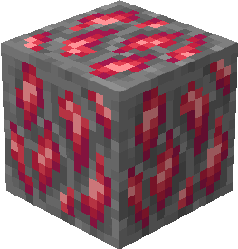
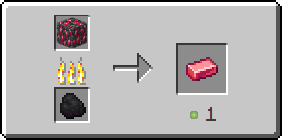

# Драгонитовая руда

Драгонитовая руда генерируется только в Нижнем мире в количестве одного блока.

<figure><figcaption>
Драгонитовая руда/ Драгонитоносный глубинный сланец
</figcaption></figure>

## Генерация

#### На какой высоте?

* От 80 до 0

#### Какой шанс генерации в чанке?

* 15%

## Получение

#### _Разрушение_

Драгонитовая руда добывается только алмазной или незеритовой киркой.


Инструменты с зачарованием _**Удача**_ не будут работать на драгонитовой руде



Инструменты с зачарованием _**Шёлковое касание**_ будут добывать драгонитовую руду, вместо [рудного драгонита](../materialy/metally-i-mineraly/rudnyi-dragonit.md)


## Использование

#### _Переплавка_

Можно переплавить в печи, получив [драгонитовый слиток](../materialy/metally-i-mineraly/dragonitovyi-slitok.md).

<figure><figcaption></figcaption></figure>
