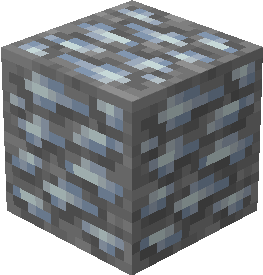
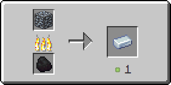

# Лабрадоритовая руда

Лабрадоритовая руда генерируется только в Верхнем мире в [определенных биомах](labradoritovaya-ruda.md#v-kakikh-biomakh) в виде скоплений, состоящих из одного — двух блоков.

<figure><figcaption>
Лабрадоритовая руда/ Лабрадоритоносный глубинный сланец
</figcaption></figure>

## Генерация

#### В каких биомах?

* [Заснеженные равнины](https://minecraft.fandom.com/ru/wiki/%D0%97%D0%B0%D1%81%D0%BD%D0%B5%D0%B6%D0%B5%D0%BD%D0%BD%D1%8B%D0%B5\_%D1%80%D0%B0%D0%B2%D0%BD%D0%B8%D0%BD%D1%8B)[ 🔗](https://minecraft.fandom.com/ru/wiki/%D0%A2%D1%91%D0%BF%D0%BB%D1%8B%D0%B9\_%D0%BE%D0%BA%D0%B5%D0%B0%D0%BD)
* [Ледяные пики](https://minecraft.fandom.com/ru/wiki/%D0%9B%D0%B5%D0%B4%D1%8F%D0%BD%D1%8B%D0%B5\_%D0%BF%D0%B8%D0%BA%D0%B8) [🔗](https://minecraft.fandom.com/ru/wiki/%D0%A2%D1%91%D0%BF%D0%BB%D1%8B%D0%B9\_%D0%BE%D0%BA%D0%B5%D0%B0%D0%BD)
* [Заснеженная тайга](https://minecraft.fandom.com/ru/wiki/%D0%97%D0%B0%D1%81%D0%BD%D0%B5%D0%B6%D0%B5%D0%BD%D0%BD%D0%B0%D1%8F\_%D1%82%D0%B0%D0%B9%D0%B3%D0%B0) [🔗](https://minecraft.fandom.com/ru/wiki/%D0%A2%D1%91%D0%BF%D0%BB%D1%8B%D0%B9\_%D0%BE%D0%BA%D0%B5%D0%B0%D0%BD)
* [Заснеженный пляж](https://minecraft.fandom.com/ru/wiki/%D0%97%D0%B0%D1%81%D0%BD%D0%B5%D0%B6%D0%B5%D0%BD%D0%BD%D1%8B%D0%B9\_%D0%BF%D0%BB%D1%8F%D0%B6) [🔗](https://minecraft.fandom.com/ru/wiki/%D0%A2%D1%91%D0%BF%D0%BB%D1%8B%D0%B9\_%D0%BE%D0%BA%D0%B5%D0%B0%D0%BD)
* [Снежные склоны](https://minecraft.fandom.com/ru/wiki/%D0%A1%D0%BD%D0%B5%D0%B6%D0%BD%D1%8B%D0%B5\_%D1%81%D0%BA%D0%BB%D0%BE%D0%BD%D1%8B) [🔗](https://minecraft.fandom.com/ru/wiki/%D0%A2%D1%91%D0%BF%D0%BB%D1%8B%D0%B9\_%D0%BE%D0%BA%D0%B5%D0%B0%D0%BD)
* [Зубчатые вершины](https://minecraft.fandom.com/ru/wiki/%D0%97%D1%83%D0%B1%D1%87%D0%B0%D1%82%D1%8B%D0%B5\_%D0%B2%D0%B5%D1%80%D1%88%D0%B8%D0%BD%D1%8B) [🔗](https://minecraft.fandom.com/ru/wiki/%D0%A2%D1%91%D0%BF%D0%BB%D1%8B%D0%B9\_%D0%BE%D0%BA%D0%B5%D0%B0%D0%BD)
* [Оледенелые вершины](https://minecraft.fandom.com/ru/wiki/%D0%9E%D0%BB%D0%B5%D0%B4%D0%B5%D0%BD%D0%B5%D0%BB%D1%8B%D0%B5\_%D0%B2%D0%B5%D1%80%D1%88%D0%B8%D0%BD%D1%8B) [🔗](https://minecraft.fandom.com/ru/wiki/%D0%A2%D1%91%D0%BF%D0%BB%D1%8B%D0%B9\_%D0%BE%D0%BA%D0%B5%D0%B0%D0%BD)

#### На какой высоте?

* От 90 до 30

#### Какой шанс генерации в чанке?

* 20%

## Получение

#### _Разрушение_

Лабрадоритовая руда добывается только алмазной или незеритовой киркой.


Инструменты с зачарованием _**Удача**_ не будут работать на лабрадоритовой руде



Инструменты с зачарованием _**Шёлковое касание**_ будут добывать лабрадоритовую руду, вместо [рудного лабрадорита](../materialy/metally-i-mineraly/rudnyi-labradorit.md)


## Использование

#### _Переплавка_

Можно переплавить в печи, получив [лабрадоритовый слиток](../materialy/metally-i-mineraly/labradoritovyi-slitok.md).

<figure><figcaption></figcaption></figure>
