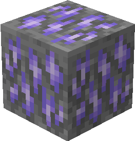

# Танзанитовая руда

Танзанитовая руда генерируется только в Крае в виде скоплений, состоящих из одного — двух блоков.

<figure><figcaption>
Танзанитовая руда/ Танзанитоносный глубинный сланец
</figcaption></figure>

## Генерация

#### На какой высоте?

* От 280 до 20

#### Какой шанс генерации в чанке?

* 20%

## Получение

#### _Разрушение_

Танзанитовая руда добывается только алмазной или незеритовой киркой.


Инструменты с зачарованием _**Удача**_ не будут работать на танзанитовой руде



Инструменты с зачарованием _**Шёлковое касание**_ будут добывать танзанитовую руду, вместо [рудного танзанита](../materialy/metally-i-mineraly/rudnyi-tanzanit.md)


## Использование

#### _Переплавка_

Можно переплавить в печи, получив [танзанитовый слиток](../materialy/metally-i-mineraly/tanzanitovyi-slitok.md).

<figure><figcaption></figcaption></figure>
