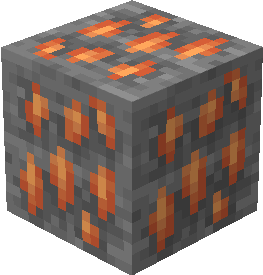

# Топазовая руда

Топазовая руда генерируется только в Верхнем мире в [определенных биомах](topazovaya-ruda.md#v-kakikh-biomakh) в виде скоплений, состоящих из одного — двух блоков.

<figure><figcaption>
Топазовая руда/ Топазоносный глубинный сланец
</figcaption></figure>

## Генерация

#### В каких биомах?

* [Пустошь](https://minecraft.fandom.com/ru/wiki/%D0%9F%D1%83%D1%81%D1%82%D0%BE%D1%88%D1%8C) 🔗
* [Лесистая пустошь](https://minecraft.fandom.com/ru/wiki/%D0%9B%D0%B5%D1%81%D0%B8%D1%81%D1%82%D0%B0%D1%8F\_%D0%BF%D1%83%D1%81%D1%82%D0%BE%D1%88%D1%8C) 🔗
* [Выветренная пустошь](https://minecraft.fandom.com/ru/wiki/%D0%92%D1%8B%D0%B2%D0%B5%D1%82%D1%80%D0%B5%D0%BD%D0%BD%D0%B0%D1%8F\_%D0%BF%D1%83%D1%81%D1%82%D0%BE%D1%88%D1%8C) 🔗
* [Грибные поля](https://minecraft.fandom.com/ru/wiki/%D0%93%D1%80%D0%B8%D0%B1%D0%BD%D1%8B%D0%B5\_%D0%BF%D0%BE%D0%BB%D1%8F) 🔗

#### На какой высоте?

* От 50 до 10

#### Какой шанс генерации в чанке?

* 10%

## Получение

#### _Разрушение_

Топазовая руда добывается только алмазной или незеритовой киркой.


Инструменты с зачарованием _**Удача**_ не будут работать на топазовой руде



Инструменты с зачарованием _**Шёлковое касание**_ будут добывать топазовую руду, вместо [рудного топаза](../materialy/metally-i-mineraly/rudnyi-topaz.md)


## Использование

#### _Переплавка_

Можно переплавить в печи, получив [топазовый слиток](../materialy/metally-i-mineraly/topazovyi-slitok.md).

<figure><figcaption></figcaption></figure>
