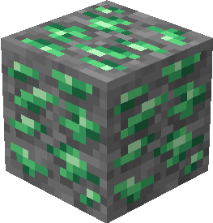
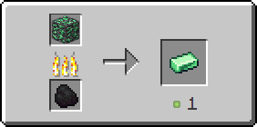

# Турмалиновая руда

Турмалиновая руда генерируется только в Верхнем мире в [определенных биомах](turmalinovaya-ruda.md#v-kakikh-biomakh) в виде скоплений, состоящих из одного — двух блоков.

<figure><figcaption>
Турмалиновая руда/ Турмалиноносный глубинный сланец
</figcaption></figure>

## Генерация

#### В каких биомах?

* [Болото](https://minecraft.fandom.com/ru/wiki/%D0%91%D0%BE%D0%BB%D0%BE%D1%82%D0%BE) 🔗
* [Мангровое болото](https://minecraft.fandom.com/ru/wiki/%D0%9C%D0%B0%D0%BD%D0%B3%D1%80%D0%BE%D0%B2%D0%BE%D0%B5\_%D0%B1%D0%BE%D0%BB%D0%BE%D1%82%D0%BE) 🔗
* [Джунгли](https://minecraft.fandom.com/ru/wiki/%D0%94%D0%B6%D1%83%D0%BD%D0%B3%D0%BB%D0%B8) 🔗
* [Бамбуковые джунгли](https://minecraft.fandom.com/ru/wiki/%D0%91%D0%B0%D0%BC%D0%B1%D1%83%D0%BA%D0%BE%D0%B2%D1%8B%D0%B5\_%D0%B4%D0%B6%D1%83%D0%BD%D0%B3%D0%BB%D0%B8) 🔗
* [Редеющие джунгли](https://minecraft.fandom.com/ru/wiki/%D0%A0%D0%B5%D0%B4%D0%B5%D1%8E%D1%89%D0%B8%D0%B5\_%D0%B4%D0%B6%D1%83%D0%BD%D0%B3%D0%BB%D0%B8) 🔗

#### На какой высоте?

* От 40 до -15

#### Какой шанс генерации в чанке?

* 10%

## Получение

#### _Разрушение_

Сапфировая руда добывается только алмазной или незеритовой киркой, в результате чего выпадет [рудный турмалин](../materialy/metally-i-mineraly/rudnyi-turmalin.md).


Инструменты с зачарованием _**Удача**_** ** не будут работать на турмалиновой руде



Инструменты с зачарованием _**Шёлковое касание**_ будут добывать турмалиновую руду, вместо [рудного турмалина](../materialy/metally-i-mineraly/rudnyi-turmalin.md)


## Использование

#### _Переплавка_

Можно переплавить в печи, получив [турмалиновый слиток](../materialy/metally-i-mineraly/turmalinovyi-slitok.md).

<figure><figcaption></figcaption></figure>
