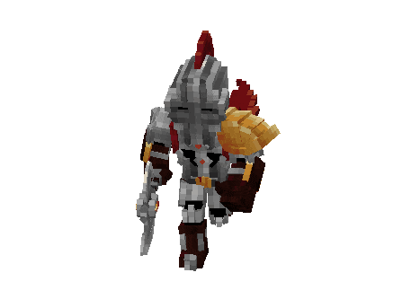

# Падший Рыцарь Огня

Кастомный моб, которого можно найти на <mark style="color:purple;">`/warp boss`</mark> в одной из комнат.

<figure><figcaption></figcaption></figure>

## Способности

## Спаун

Падший Рыцарь Огня спаунится в центре арены каждые 2 часа после своей смерти.

## Дроп

* [пылающая эссенция](../../essencii/pylayushaya-essenciya.md) с шансом 50%
* от 32 до 64 железных слитка
* от 2 до 6 зелья лечения
* от 0 до 2 зелья силы
