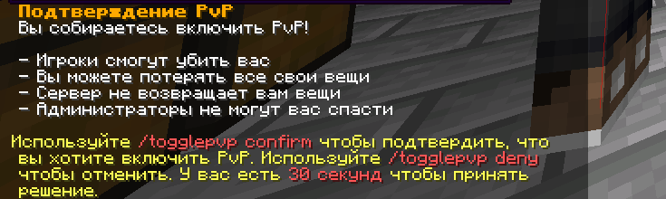

# 4. Игровой процесс

#### 4.1 Игрок обязан следить за состоянием своего имущества, а также прилегающей территории в размере 15-20 кубических блоков.

#### 4.2 Запрещается использование нецензурной лексики, лжи, оскорблений, угроз и провокаций в игровом мире (например, на табличках, в названиях приватов, книгах и т.д.).

#### 4.3 Запрещается использование неприличных скинов и плащей.

#### 4.4 Запрещено игнорировать просьбы модератора покинуть территорию или постройку, так как это может мешать другим игрокам.

#### 4.5 Если вы включаете режим PvP с помощью команды /togglepvp, то никто не будет помогать вам даже если вы находитесь в своей территории.

<figure><figcaption></figcaption></figure>

